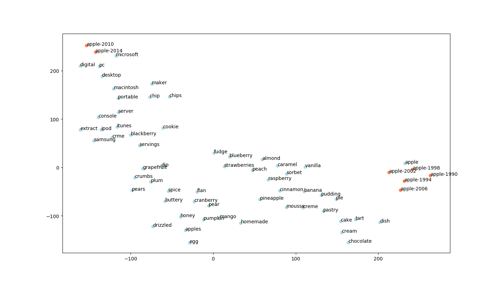
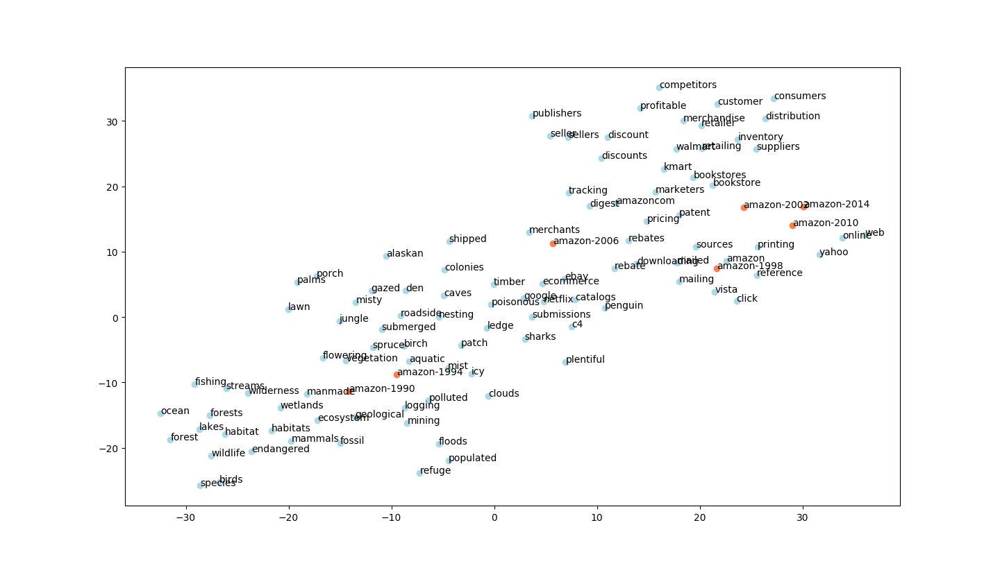
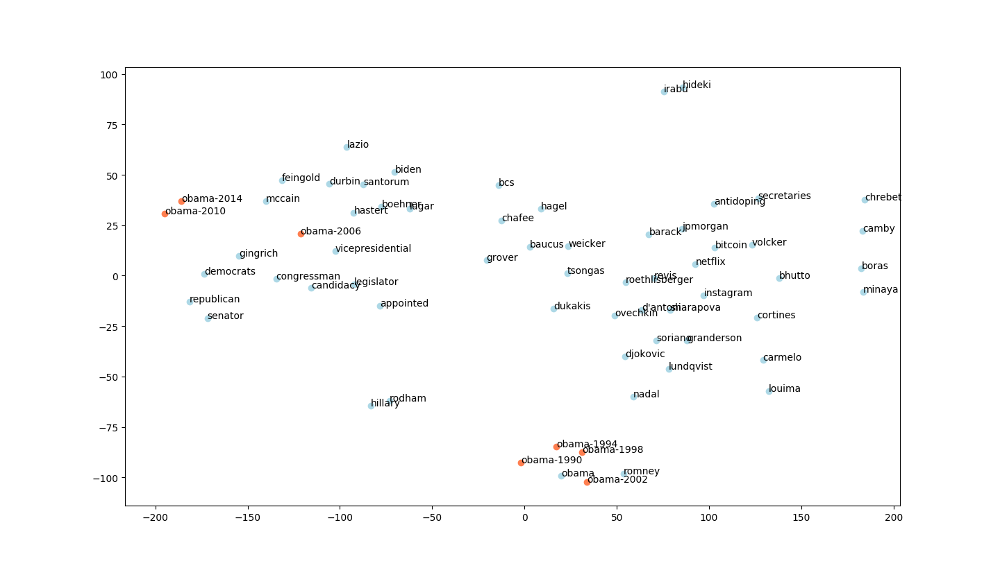
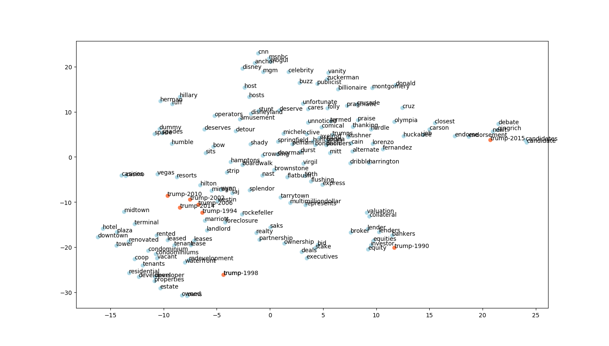

# doc-word2vec baseline
Trajectory visualization for temporal embeddings per section 5.1 in Yao et al., 2018 (https://arxiv.org/pdf/1703.00607.pdf)

The 2D t-SNE projection of a word and its most similar words over various time slices are plotted with a user determined perplexity.

## How to Run
To execute the baseline evaluation script, run the following in terminal:
```python3 nyt_trajectory.py```

It will prompt you with
```Which word would you like to visualize the trajectory for?:```
Type the word you would like to create a trajectory for

Then, after it finds the most similar words at each time slice, it will prompt you to choose perplexity
```Enter the perplexity value (5-50) for the tSNE projection or 'n' to quit:```
This perplexity is used to generate a plot of a 2D tSNE projection.
After you close the plot, it will prompt you with this again, so you can generate projections with varying perplexities.
Play with it and have fun! : )

## Scoring the system
Because this is a qualitative metric, there is no direct method to score.
However, the trajectories we generated can be compared to those in Yao et al., 2018. They are very close. In fact, they differences are probably entirely attributable to the distortions and randomness of generating a tSNE projection.

Our simple baseline method for generating the embedding was to be time agnostic PPMI, as such, the trajectories are static.
We initially wanted to compare the semantic similarity scores (see milestone 2) for the two embeddings, however the labels were not available for the NYT dataset used in the paper, which makes such a comparison impossible.
Nonetheless, we still have some wonderful trajectory visualization as our evaluation!





